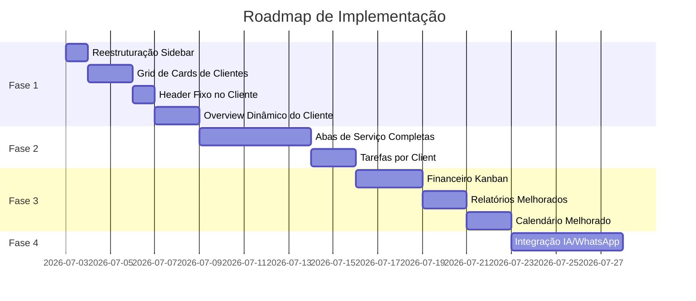
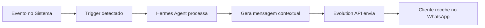

# 🎯 Plano de Reestruturação — Sistema ONBOARDING CAEN

> **Objetivo:** Transformar o sistema de uma arquitetura centrada em serviços globais para uma arquitetura **centrada no cliente**, eliminando redundâncias, melhorando a eficiência operacional e criando uma experiência mais dinâmica e profissional.

---

## Decisões Alinhadas (Entrevista)

| # | Decisão | Resposta |
|---|---------|----------|
| 1 | Serviços na sidebar | **Remover completamente** — serviços só existem dentro de cada cliente |
| 2 | Rotas globais de serviços | **Eliminar** `/agency/traffic`, `/agency/social`, `/agency/web`, `/agency/crm` |
| 3 | Conteúdo das abas de serviço | **Completo** — telas reais adaptadas ao contexto do cliente (não placeholders) |
| 4 | Tela de overview do cliente | **Redesenhada** com KPIs, mini-cards de serviços, timeline de atividades |
| 5 | Navegação dentro do cliente | **Header fixo (sticky)** com nome do cliente à esquerda e links de módulos |
| 6 | Módulos no header | **Overview + Onboarding sempre** + apenas módulos habilitados no `modules_enabled` |
| 7 | Listagem de clientes | **Grid de cards** (estilo Pinterest) — 3 colunas desktop, 2 tablet, 1 mobile |
| 8 | Submenus Overview/Pipeline | **Removidos** do sidebar de Clientes |
| 9 | Tarefas no cliente | **Filtrar automaticamente** por `client_id` — tarefas operacionais refletem no cliente |
| 10 | Financeiro | **Kanban** com colunas: Em Dia, Pendente, Atrasado, Pago |
| 11 | IA/WhatsApp | **Notificações automáticas** via Evolution API quando há atualizações nos serviços |

---

## Visão Geral das Fases



---

## FASE 1 — Reestruturação da Navegação e Experiência do Cliente

> **Impacto:** Alto | **Complexidade:** Média | **Prioridade:** 🔴 Urgente

### 1.1 — Reestruturação da Sidebar da Agência

**O que muda:**
- ❌ Remover grupo **"Serviços"** completo (Tráfego Pago, Social Media, Web, CRM & Tech)
- ❌ Remover **subItems** "Overview" e "Pipeline" do item Clientes
- ✅ Item "Clientes" fica como link direto para `/agency/clients` sem sub-menus

**Arquivos a modificar:**

| Arquivo | Ação |
|---------|------|
| `src/components/sidebar/Sidebar.tsx` | Remover linhas 58-61 (subItems Overview/Pipeline) e linhas 81-124 (grupo Serviços inteiro) |
| `src/App.tsx` | Remover rotas `/agency/traffic`, `/agency/social`, `/agency/web`, `/agency/crm` e seus imports |

**Sidebar ANTES → DEPOIS:**

```diff
 📌 Gestão
-  ├── Clientes
-  │   ├── Overview
-  │   └── Pipeline
+  ├── Clientes (link direto)
   ├── Equipe
   └── Acessos

-📌 Serviços
-  ├── Tráfego Pago (Dashboard, Campanhas, Otimizações)
-  ├── Social Media (Calendário, Produção, Aprovações)
-  ├── Web (Projetos, Entregas)
-  └── CRM & Tech (Integrações, Automações)
```

### 1.2 — Grid de Cards na Listagem de Clientes

**O que muda:**
- ❌ Remover `DataTable` (tabela) da listagem de clientes
- ✅ Criar componente `ClientCardGrid` com grid responsivo
- ✅ Cada card exibe: nome, status (badge), ícones dos módulos ativos, responsável, valor pendente, botão de acesso

**Arquivos a modificar/criar:**

| Arquivo | Ação |
|---------|------|
| `src/components/tables/ClientListPage.tsx` | Refatorar para usar grid de cards ao invés de DataTable |
| `src/components/cards/ClientCard.tsx` | **CRIAR** — componente de card individual do cliente |

**Especificação do Card:**

```
┌──────────────────────────────┐
│  🏢 Nome da Empresa          │
│  ●  Ativo                    │  ← StatusBadge
│                              │
│  📊 🎯 🌐 📱                │  ← Ícones dos módulos ativos
│                              │
│  👤 João Silva               │  ← Responsável
│  💰 R$ 2.500,00 pendente     │  ← Valor pendente (amarelo se > 0)
│                              │
│  [ Ver Cliente →  ]          │  ← Link para /agency/clients/:id
└──────────────────────────────┘
```

**Grid responsivo:**
- Desktop (≥1280px): 3 colunas
- Tablet (≥768px): 2 colunas
- Mobile (<768px): 1 coluna

### 1.3 — Header Fixo (Sticky) na Página do Cliente

**O que muda:**
- ❌ Remover sistema de `<Tabs>` + `<TabsList>` + `<TabsTrigger>` atual
- ✅ Criar componente `ClientHeader` — barra sticky no topo da página do cliente
- ✅ Navegação por sub-rotas ao invés de abas controladas por estado

**Arquivos a modificar/criar:**

| Arquivo | Ação |
|---------|------|
| `src/components/ui/ClientHeader.tsx` | **CRIAR** — header fixo com nome do cliente + navegação de módulos |
| `src/app/agency/clients/[id]/page.tsx` | **REFATORAR** — trocar Tabs por layout com ClientHeader + Outlet para sub-rotas |
| `src/App.tsx` | **ADICIONAR** sub-rotas aninhadas dentro de `/agency/clients/:id/*` |

**Design do Header:**

```
┌──────────────────────────────────────────────────────────────────────┐
│  🏢 Nome da Empresa   │  Overview  │  Onboarding  │  Tráfego  │ …  │
│                        │  (ativo)   │              │           │    │
│  [Acessar Portal]  [Editar]                                        │
└──────────────────────────────────────────────────────────────────────┘
```

**Características:**
- `position: sticky; top: 0; z-index: 40`
- Nome do cliente/empresa à esquerda com avatar
- Links de navegação ao lado (horizontal scroll em mobile)
- Módulos exibidos: **Overview** e **Onboarding** sempre + módulos do `modules_enabled`
- Botões de ação (Acessar Portal, Editar) à direita
- Fundo com blur/glass effect para visual premium

**Nova estrutura de rotas:**

```
/agency/clients/:id             → Overview (padrão)
/agency/clients/:id/onboarding  → Onboarding
/agency/clients/:id/traffic     → Tráfego Pago
/agency/clients/:id/social      → Social Media
/agency/clients/:id/web         → Web
/agency/clients/:id/crm         → CRM & Tech
/agency/clients/:id/approvals   → Aprovações
/agency/clients/:id/tasks       → Tarefas
/agency/clients/:id/documents   → Documentos
/agency/clients/:id/financial   → Financeiro
/agency/clients/:id/support     → Suporte
/agency/clients/:id/access      → Acessos
```

### 1.4 — Overview Dinâmico do Cliente

**O que muda:**
- ❌ Remover a aba "Visão Geral" estática com apenas dados cadastrais
- ✅ Criar página de Overview dinâmica e rica em informações

**Arquivos a criar:**

| Arquivo | Ação |
|---------|------|
| `src/app/agency/clients/[id]/overview/page.tsx` | **CRIAR** — página de overview com dashboard do cliente |
| `src/components/cards/ClientKPICard.tsx` | **CRIAR** — card de KPI individual |
| `src/components/cards/ServiceSummaryCard.tsx` | **CRIAR** — mini-card de resumo de serviço |

**Layout do Overview:**

```
┌─────────────────────────────────────────────────────────┐
│                    HEADER FIXO (sticky)                  │
├─────────────────────────────────────────────────────────┤
│                                                         │
│  ┌──────────┐ ┌──────────┐ ┌──────────┐ ┌──────────┐   │
│  │ Status   │ │ Módulos  │ │ Pendente │ │Responsáv │   │
│  │ ● Ativo  │ │ 4 ativos │ │ R$2.500  │ │ J.Silva  │   │
│  └──────────┘ └──────────┘ └──────────┘ └──────────┘   │
│                                                         │
│  ── Resumo dos Serviços ──────────────────────────────  │
│                                                         │
│  ┌─────────────────┐ ┌─────────────────┐                │
│  │ 📊 Tráfego Pago │ │ 📱 Social Media │                │
│  │ 3 campanhas     │ │ 12 posts/mês    │                │
│  │ R$ 5.2k invest. │ │ 2 aguardando    │                │
│  │ [Ver →]         │ │ [Ver →]         │                │
│  └─────────────────┘ └─────────────────┘                │
│  ┌─────────────────┐ ┌─────────────────┐                │
│  │ 🌐 Web          │ │ 🔧 CRM & Tech  │                │
│  │ 1 projeto ativo │ │ 3 integrações   │                │
│  │ 85% progresso   │ │ 1 automação     │                │
│  │ [Ver →]         │ │ [Ver →]         │                │
│  └─────────────────┘ └─────────────────┘                │
│                                                         │
│  ── Dados Cadastrais ─────────────────────────────────  │
│  Razão Social: ... | CNPJ: ... | Telefone: ... | ...   │
│                                                         │
│  ── Atividades Recentes ──────────────────────────────  │
│  • 2h atrás — Campanha "Black Friday" criada           │
│  • 1d atrás — Post aprovado pelo cliente               │
│  • 3d atrás — Fatura #123 paga                         │
│                                                         │
└─────────────────────────────────────────────────────────┘
```

**Dados para KPIs e resumos (queries Supabase):**
- Status do cliente → `clients.status`
- Módulos ativos → `clients.modules_enabled`
- Valor pendente → `financial_invoices` filtrado por `client_id` e `status = 'pending'`
- Responsável → join `profiles` via `clients.assigned_to`
- Resumo de tráfego → `traffic_campaigns` filtrado por `client_id`
- Resumo de social → contar posts/aprovações do mês
- Resumo de web → projetos ativos filtrados
- Atividades recentes → combinar updates de múltiplas tabelas

---

## FASE 2 — Serviços Completos nas Abas + Tarefas por Cliente

> **Impacto:** Alto | **Complexidade:** Alta | **Prioridade:** 🟠 Importante

### 2.1 — Abas de Serviço com Conteúdo Completo

**O que muda:**
- ❌ Remover placeholders ("Preview de Tráfego Aqui", etc.)
- ✅ Migrar a lógica das páginas globais para componentes reutilizáveis filtrados por `client_id`

**Estratégia:** Extrair o conteúdo de cada página global de serviço (`AgencyTrafficPage`, `AgencySocialPage`, etc.) em **componentes reutilizáveis** que aceitem `clientId` como prop, e usá-los dentro das sub-rotas do cliente.

**Arquivos a criar/modificar por serviço:**

#### Tráfego Pago
| Arquivo | Ação |
|---------|------|
| `src/components/modules/TrafficModule.tsx` | **CRIAR** — componente com dashboard, campanhas e otimizações filtrado por clientId |
| `src/app/agency/clients/[id]/traffic/page.tsx` | **CRIAR** — página que renderiza TrafficModule |
| `src/app/agency/traffic/page.tsx` | **REMOVER** após migração |

#### Social Media
| Arquivo | Ação |
|---------|------|
| `src/components/modules/SocialModule.tsx` | **CRIAR** — calendário, produção, aprovações filtrado por clientId |
| `src/app/agency/clients/[id]/social/page.tsx` | **CRIAR** — página que renderiza SocialModule |
| `src/app/agency/social/page.tsx` | **REMOVER** após migração |

#### Web
| Arquivo | Ação |
|---------|------|
| `src/components/modules/WebModule.tsx` | **CRIAR** — projetos e entregas filtrado por clientId |
| `src/app/agency/clients/[id]/web/page.tsx` | **CRIAR** — página que renderiza WebModule |
| `src/app/agency/web/page.tsx` | **REMOVER** após migração |

#### CRM & Tech
| Arquivo | Ação |
|---------|------|
| `src/components/modules/CRMModule.tsx` | **CRIAR** — integrações e automações filtrado por clientId |
| `src/app/agency/clients/[id]/crm/page.tsx` | **CRIAR** — página que renderiza CRMModule |
| `src/app/agency/crm/page.tsx` | **REMOVER** após migração |

### 2.2 — Tarefas Refletindo no Cliente

**O que muda:**
- ✅ Na aba "Tarefas" de cada cliente, exibir automaticamente todas as tarefas vinculadas pelo `client_id`
- ✅ Tarefas criadas no módulo operacional (Tarefas, Fluxos) com `client_id` aparecem dentro do cliente

**Arquivos a criar/modificar:**

| Arquivo | Ação |
|---------|------|
| `src/components/modules/ClientTasksModule.tsx` | **CRIAR** — lista/kanban de tarefas filtradas por clientId |
| `src/app/agency/clients/[id]/tasks/page.tsx` | **CRIAR** — página que renderiza ClientTasksModule |

**Query de dados:**
```sql
SELECT * FROM tasks
WHERE client_id = :clientId
ORDER BY created_at DESC;
```

---

## FASE 3 — Financeiro Kanban + Relatórios + Calendário

> **Impacto:** Médio | **Complexidade:** Média | **Prioridade:** 🟡 Planejado

### 3.1 — Financeiro em Formato Kanban

**O que muda:**
- ❌ Remover visualização atual do financeiro (se for tabela/lista)
- ✅ Criar board Kanban com colunas de status de pagamento

**Colunas do Kanban:**

| Coluna | Descrição | Cor |
|--------|-----------|-----|
| Em Dia | Faturas dentro do prazo | 🟢 Verde |
| Pendente | Faturas próximas ao vencimento | 🟡 Amarelo |
| Atrasado | Faturas vencidas | 🔴 Vermelho |
| Pago | Faturas já pagas | 🔵 Azul |

**Funcionalidade:** Arrastar cards entre colunas para alterar o status do pagamento.

**Arquivos a criar/modificar:**

| Arquivo | Ação |
|---------|------|
| `src/components/kanban/FinancialKanban.tsx` | **CRIAR** — board kanban financeiro (pode reutilizar base do KanbanBoard existente) |
| `src/app/agency/financial/page.tsx` | **REFATORAR** — integrar FinancialKanban |
| `src/app/agency/clients/[id]/financial/page.tsx` | **CRIAR** — FinancialKanban filtrado por clientId |

### 3.2 — Relatórios Melhorados

**A definir em detalhe.** Foco em:
- Relatórios por cliente com dados consolidados de todos os serviços
- Exportação em PDF
- Templates customizáveis

### 3.3 — Calendário Melhorado

**A definir em detalhe.** Foco em:
- Visualização unificada de entregas, publicações e vencimentos
- Integração com tarefas e social media
- Filtro por cliente

---

## FASE 4 — Integração IA/WhatsApp

> **Impacto:** Alto | **Complexidade:** Alta | **Prioridade:** 🟣 Futuro

### 4.1 — Notificações Automáticas via WhatsApp

**Stack de integração:**
- **Evolution API** — API para conexão com WhatsApp
- **Hermes Agent** — Agente IA para processamento e geração de mensagens
- **OpenCode Zen** — Framework para o agente

**Fluxo:**



**Eventos que disparam notificações:**
- Campanha de tráfego atingiu métrica importante
- Nova peça aguardando aprovação
- Fatura gerada ou vencendo
- Tarefa concluída
- Relatório mensal disponível

**Arquivos a criar:**

| Arquivo | Ação |
|---------|------|
| `src/services/evolution.service.ts` | **CRIAR** — serviço de integração com Evolution API |
| `src/services/hermes.service.ts` | **CRIAR** — serviço de integração com Hermes Agent |
| `src/components/modules/WhatsAppNotifications.tsx` | **CRIAR** — UI de configuração de notificações |
| Supabase Edge Function | **CRIAR** — function para processar triggers e enviar notificações |

---

## Resumo de Arquivos Impactados

### Arquivos a REMOVER (após migração completa)

| Arquivo | Motivo |
|---------|--------|
| `src/app/agency/traffic/page.tsx` | Serviço migrado para dentro do cliente |
| `src/app/agency/social/page.tsx` | Serviço migrado para dentro do cliente |
| `src/app/agency/web/page.tsx` | Serviço migrado para dentro do cliente |
| `src/app/agency/crm/page.tsx` | Serviço migrado para dentro do cliente |

### Arquivos a MODIFICAR

| Arquivo | Mudança |
|---------|---------|
| `src/components/sidebar/Sidebar.tsx` | Remover grupo Serviços + subItems de Clientes |
| `src/App.tsx` | Remover rotas globais de serviços, adicionar sub-rotas de cliente |
| `src/components/tables/ClientListPage.tsx` | Trocar DataTable por grid de cards |
| `src/app/agency/clients/[id]/page.tsx` | Refatorar para layout com ClientHeader + sub-rotas |
| `src/app/agency/financial/page.tsx` | Integrar Kanban financeiro |

### Arquivos a CRIAR

| Arquivo | Propósito |
|---------|-----------|
| `src/components/cards/ClientCard.tsx` | Card individual na grid de clientes |
| `src/components/ui/ClientHeader.tsx` | Header fixo sticky na página do cliente |
| `src/components/cards/ClientKPICard.tsx` | Card de KPI no overview |
| `src/components/cards/ServiceSummaryCard.tsx` | Mini-card de resumo de serviço |
| `src/app/agency/clients/[id]/overview/page.tsx` | Página de overview dinâmico |
| `src/components/modules/TrafficModule.tsx` | Módulo de tráfego reutilizável |
| `src/components/modules/SocialModule.tsx` | Módulo de social reutilizável |
| `src/components/modules/WebModule.tsx` | Módulo de web reutilizável |
| `src/components/modules/CRMModule.tsx` | Módulo de CRM reutilizável |
| `src/components/modules/ClientTasksModule.tsx` | Módulo de tarefas do cliente |
| `src/components/kanban/FinancialKanban.tsx` | Kanban financeiro |
| `src/services/evolution.service.ts` | Integração Evolution API |
| `src/services/hermes.service.ts` | Integração Hermes Agent |

---

## Regras de Implementação

> [!IMPORTANT]
> 1. **Sempre manter backward compatibility** — não quebrar funcionalidades existentes durante migração
> 2. **Testar cada fase isoladamente** antes de avançar para a próxima
> 3. **Manter os módulos do portal do cliente (`/client/*`) intactos** — as mudanças são apenas no portal da agência
> 4. **Queries Supabase devem respeitar RLS** — garantir que as policies continuem funcionando com os filtros por client_id
> 5. **Componentes de módulo devem ser agnósticos** — aceitar `clientId` como prop para funcionar tanto no contexto do cliente quanto em futuras visões consolidadas

---

## Critérios de Sucesso

- [ ] Sidebar da agência não tem mais grupo "Serviços" nem submenus Overview/Pipeline
- [ ] Listagem de clientes exibe grid de cards responsivo
- [ ] Página do cliente tem header fixo com navegação contextual
- [ ] Overview do cliente mostra KPIs, resumo de serviços e atividades recentes
- [ ] Cada aba de serviço tem conteúdo real (não placeholder)
- [ ] Tarefas criadas com client_id aparecem na aba de tarefas do cliente
- [ ] Financeiro funciona em formato Kanban com drag-and-drop
- [ ] Notificações automáticas via WhatsApp estão operacionais
